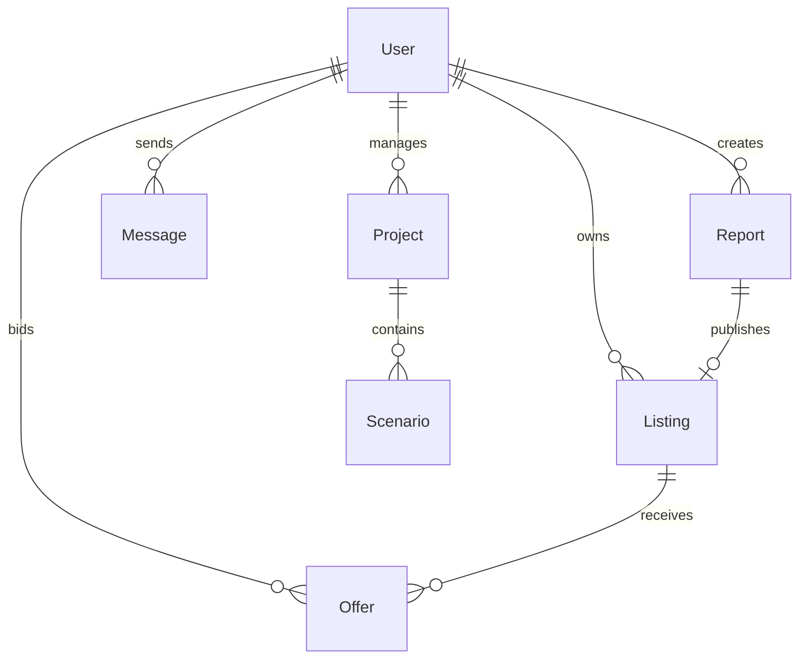

# ArsaBil — Türkiye'nin Arsa Payı ve Kat Karşılığı Fizibilite Motoru

<p align="center">
  <strong>🏗️ Arsa sahipleri ve müteahhitler için akıllı fizibilite analizi platformu</strong>
</p>

---

## 🎯 Ne İşe Yarar?

ArsaBil, Türkiye'deki kat karşılığı inşaat projelerinde **arsa payı oranlarını**, **fizibilite skorlarını** ve **yatırım getirilerini** otomatik hesaplayan bir SaaS platformudur.

**Hedef Kullanıcılar:** Arsa sahipleri · Müteahhitler · Gayrimenkul danışmanları

---

## 🚀 Özellikler

### 📊 Hesap Makinesi (Engine v2)
- Daire standardı (Düşük / Orta / Yüksek) seçimi
- Toplam daire sayısı toggle ile ayarlanabilir
- İksa masrafı (Yüzde / Elle) desteği
- Risk payı ve müteahhit kazancı parametreleri
- **Anlık sonuç:** Toplam daire fiyatı, m² birim fiyatı, arsa payı
- PDF rapor indirme ve kaydetme

### 🏪 Pazar Yeri (Marketplace)
- Harita / Liste / Split görünüm modları
- 81 il + 79 ilçe (İstanbul, Ankara, İzmir, Bursa, Antalya) desteği
- Fizibilite skoru bazlı filtreleme ve sıralama
- İlan detay sayfası + teklif sistemi

### 🗺️ Harita Özellikleri (OpenStreetMap + Leaflet)
| Özellik | Açıklama |
|---------|----------|
| 🗺️ Tile Toggle | CartoDB Dark / Light / ESRI Uydu |
| 📊 Marker Clustering | Skor bazlı renk gruplandırma |
| 📍 Parsel Pinleme | Nominatim reverse geocoding |
| 🔥 Heatmap | Fizibilite skoru yoğunluk katmanı |
| ✏️ Polygon Çizim | Bölge seçimi + alan hesaplama (m²/dönüm) |
| 🗺 İl Sınırları | GeoJSON ile il sınır çizimi |
| 📐 Mesafe Ölçüm | Polyline ile m/km hesaplama |
| 🏘️ İlçe Zoom | Sokak seviyesi (zoom 14) navigasyon |
| 🗺️ Mini Harita | İlan detayında konum gösterimi |

### 📈 Analiz ve Grafikler
- Maliyet dağılım pasta grafiği
- Piyasa değeri karşılaştırma (Adil Değer gauge)
- Hassasiyet analizi (Sensitivity chart)
- Başabaş noktası (Break-even chart)
- Risk göstergesi (Gauge chart)

### 💬 Mesajlaşma (Inbox)
- WhatsApp tarzı sohbet arayüzü
- Okundu / iletildi / görüldü tik sistemi
- Teklif bazlı mesajlaşma

### 🔐 Kimlik Doğrulama
- NextAuth.js ile JWT tabanlı oturum yönetimi
- Kullanıcı rolleri: `USER`, `ADMIN`, `MUTEAHHIT`, `ARSA_SAHIBI`, `DANISMAN`
- Kayıt ve giriş sayfaları

### 🛠️ Admin Paneli
- Genel bakış istatistikleri
- Motor ayarları (iksa oranları)
- Kullanıcı yönetimi

---

## 🏗️ Teknoloji Altyapısı

| Katman | Teknoloji |
|--------|-----------|
| Frontend | Next.js 16 + React 19 + TypeScript |
| Stil | CSS Modules + Glassmorphism UI |
| Harita | Leaflet + OpenStreetMap (ücretsiz) |
| Grafik | Chart.js + react-chartjs-2 |
| Auth | NextAuth.js (JWT + Prisma Adapter) |
| Veritabanı | Prisma ORM + SQLite (geliştirme) |
| PDF | jsPDF + jspdf-autotable |
| Test | Jest + ts-jest |

---

## 📁 Proje Yapısı

```
arsabil/
├── prisma/
│   └── schema.prisma          # Veritabanı şeması
├── src/
│   ├── app/
│   │   ├── page.tsx            # Hesap Makinesi (Ana sayfa)
│   │   ├── marketplace/        # Pazar Yeri
│   │   ├── listing/[id]/       # İlan Detay
│   │   ├── inbox/              # Mesajlaşma
│   │   ├── admin/              # Admin Paneli
│   │   ├── dashboard/          # Kullanıcı Dashboard
│   │   ├── login/              # Giriş
│   │   ├── register/           # Kayıt
│   │   └── api/                # REST API Endpoints
│   ├── components/
│   │   ├── marketplace/        # MapView, CitySearch, MiniMap, vb.
│   │   ├── charts/             # Grafik bileşenleri
│   │   ├── ui/                 # Card, Button, Toggle, Input, vb.
│   │   └── layout/             # Navbar, Footer
│   └── lib/
│       ├── calculator/         # Engine v2 hesaplama modülü
│       ├── pdf/                # PDF rapor oluşturucu
│       └── prisma.ts           # Prisma client
└── package.json
```

---

## ⚡ Kurulum

```bash
# 1. Depo klonla
git clone <repo-url>
cd arsabil

# 2. Bağımlılıkları kur
npm install

# 3. Veritabanını oluştur
npx prisma db push

# 4. Geliştirme sunucusunu başlat
npm run dev
```

Uygulama `http://localhost:3000` adresinde çalışır.

### Ortam Değişkenleri (.env)

```env
NEXTAUTH_SECRET=<rastgele-gizli-anahtar>
NEXTAUTH_URL=http://localhost:3000
DATABASE_URL=file:./dev.db
```

---

## 📊 Veritabanı Şeması



**Kullanıcı Rolleri:** `USER` · `ADMIN` · `MUTEAHHIT` · `ARSA_SAHIBI` · `DANISMAN`

---

## 📜 Lisans

Bu proje özel kullanım içindir. Tüm hakları saklıdır.

---

<p align="center">
  <sub>ArsaBil © 2026 — Türkiye'nin Arsa Payı ve Kat Karşılığı Fizibilite Motoru</sub>
</p>
